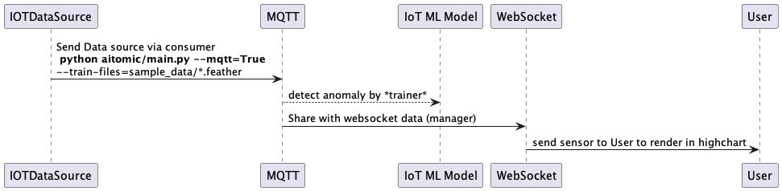
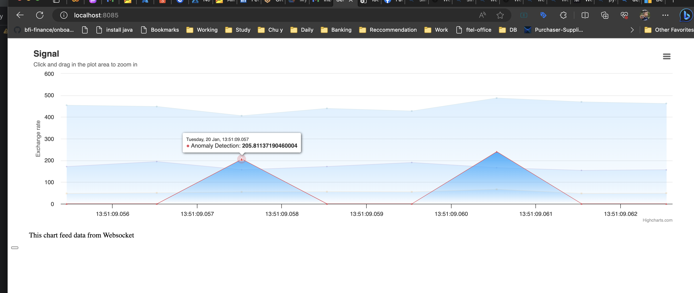

# Stack
* PEFT/Lora for training existing model from HuggingFace
* Fastapi and websocket: render IoT Signal and failure/anomaly detection
* Pytest(unit-test)
* Frontend: websocket, HTML and highchartJS [index.html](aitomic%2Findex.html)
# Diagram



# Demo



# Installation
```shell
git clone https://github.com/weburnit/llm-iot
cd llm-iot

pip install -r requirements.txt
pip install -e .
```
# Train

```shell
python main.py --train-files=sample_data/iot_pmfp_data.feather,sample_data/iot_pmfp_labels.feather
               --metadata-file=sample_data/metadata.json
               --train-base-model=google/flan-t5-base
               --trained-new-name=iot-device
               --train=True
```

# Start

We train the new model `iot-device` from `google/flan-t5-base`, time to start the service from there

```shell
python aitomic/main.py --train-base-model=google/flan-t5-base
               --trained-new-name=iot-device
               --train=False
```

# Mock MQTT by using feather data

```shell
python aitomic/main.py --mqtt=true --train-files=sample_data/iot_pmfp_data.feather,sample_data/iot_pmfp_labels.feather
```

# Training model with IOT device signal

[Data point](sample_data) for training only relies on these features(vibration,rotate,pressure, volt, failure, anomaly)

Here is a summary of the main aspects of the Trainer class:

## Initialization:

At the start, the `Trainer` is initialized with a model, tokenizer, and datasets (all set to None). There are also
placeholders for LoRA configurations and paths to data files.

## Data Loading and Preparation:

The `load_data` and `prepare_dataset` functions are used to load the data from specified feather files and a metadata
file. The data is then prepared by splitting it into training, validation, and test sets.

## Model Training:

The `train` function first loads the data, then prepares the model for k-bit training. The function also configures a
training directory, sets up the training arguments, and creates a transformers.Trainer instance. Finally, the model is
trained and the result is returned.

## Model Generation:

The generate function uses the loaded model and tokenizer to generate a response to a given prompt.

## From the class I have learnt about:

* How to load and prepare data for a sequence-to-sequence machine learning model.
* How to train a model using the Transformers library and additional optimization techniques by `peft` and `lora`

## Missing part

* Dont't adopt `accelerate` to speed up training
* Lack of ReactJS skill to complete nicer frontend. I can understand highchart and adopt it in Pure JS
